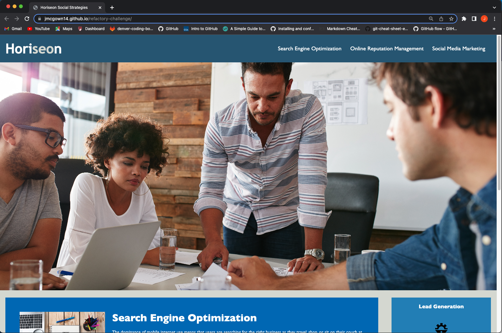
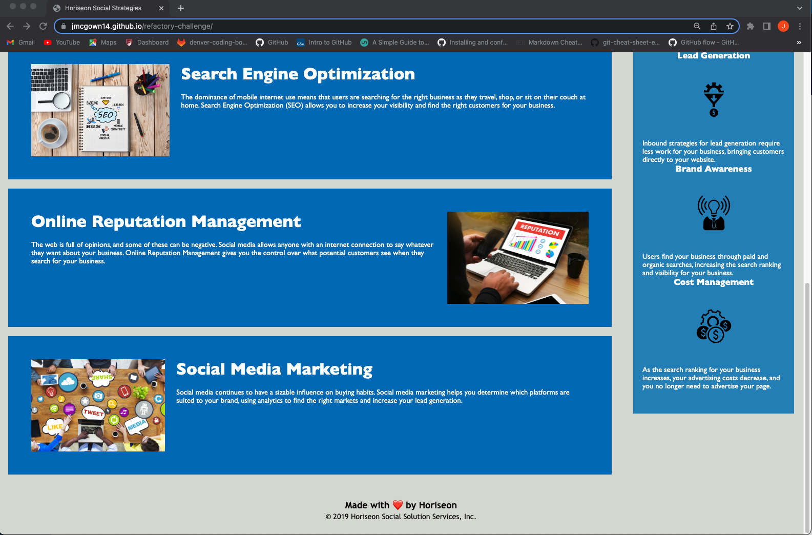

# On-the-job Week One Challenge

## Took Starter Code that was given and:

* Added systematic HTML to be easier read when viewing the code
* Added Alt Attributes to pictures
* Condensed CSS styles and organized to follow the follow of HTML
* Commented on CSS to easier read styling changes that are happening

## In Github:

* Created repository for assignment
* Deployed a live URL
* Contains commit messages of changes that were made through working on the code

